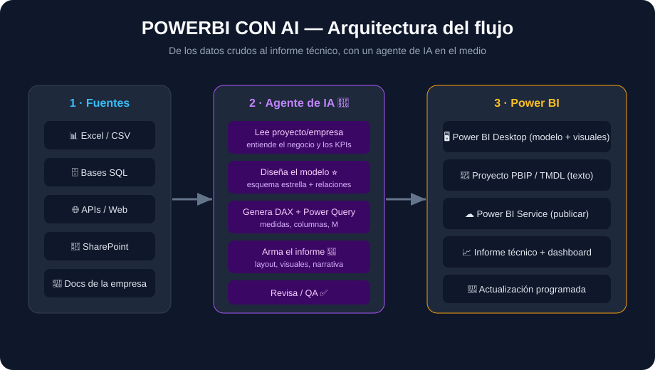
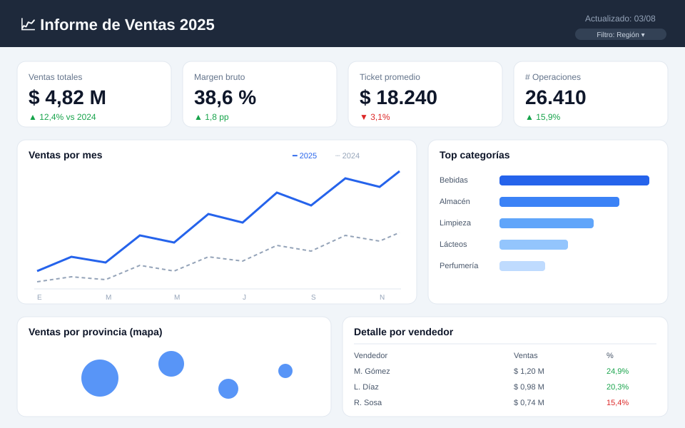
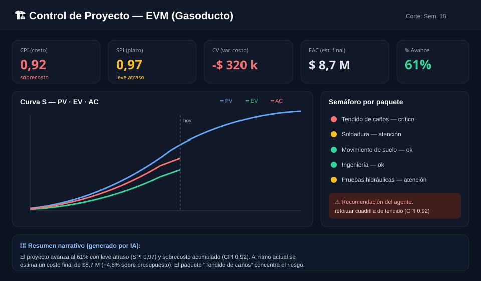

# 🤖📊 POWERBI CON AI

> **Guía completa + agente de IA para generar informes técnicos en Power BI.**
> El agente **lee tu proyecto o tu empresa**, entiende el negocio, **diseña el modelo de datos**, **escribe las medidas DAX y el Power Query**, y **arma el informe** — vos solo lo abrís en Power BI Desktop.

<p align="center">
  
</p>

---

## 🎯 De qué se trata

Hacer un informe de Power BI a mano lleva horas: limpiar datos, armar el modelo, pensar KPIs, escribir DAX, diseñar visuales. La mayor parte de ese trabajo es **texto y lógica** — justo lo que un agente de IA hace bien.

Este repo te da **dos cosas**:

1. **📚 Una guía paso a paso** (carpeta [`docs/`](docs/)) para hacer un informe de Power BI de cero, incluso si nunca lo usaste.
2. **🤖 Un agente de IA listo para usar** (carpeta [`agente-ia/`](agente-ia/)) — un conjunto de _prompts_ encadenados que convierten "tengo estos datos / esta empresa" en "tengo el modelo, las medidas y el informe armados".

Y **[ejemplos completos y reproducibles](ejemplos/)** con datos, medidas e imágenes de cómo queda.

---

## 🗺️ Índice

### 📚 Guía (docs/)
| # | Documento | Qué aprendés |
|---|-----------|--------------|
| 01 | [Qué es y cómo usar este repo](docs/01-que-es-y-como-usar.md) | El mapa completo y por dónde empezar |
| 02 | [Instalar Power BI Desktop](docs/02-instalar-power-bi.md) | Descarga, versión gratis, requisitos |
| 03 | [El flujo con IA (visión general)](docs/03-flujo-con-ia.md) | Cómo encaja el agente en el proceso |
| 04 | [Preparar los datos](docs/04-preparar-datos.md) | Limpieza, formatos, Power Query (M) |
| 05 | [El modelo estrella](docs/05-modelo-estrella.md) | Hechos vs. dimensiones, relaciones |
| 06 | [Medidas DAX](docs/06-medidas-dax.md) | KPIs, % variación, YTD, time intelligence |
| 07 | [Visuales y diseño](docs/07-visuales-y-diseno.md) | Elegir gráficos, layout, buenas prácticas |
| 08 | [Publicar y compartir](docs/08-publicar-y-compartir.md) | Power BI Service, actualización automática |

### 🤖 Agente de IA (agente-ia/)
| Recurso | Para qué |
|---------|----------|
| [Cómo funciona el agente](agente-ia/README.md) | La idea general y cómo lo usás |
| [El flujo de 5 fases](agente-ia/flujo.md) | Leer → Modelar → Medir → Armar → Revisar |
| [Prompts encadenados](agente-ia/prompts/) | Los 6 prompts listos para copiar/pegar |
| [Plantillas de entrada](agente-ia/plantillas/) | Brief de empresa + especificación de informe |

### 🔁 Automatización (automatizacion/)
| Recurso | Para qué |
|---------|----------|
| [El loop Make → Power BI](automatizacion/README.md) | Cómo se refrescan los datos solos, todos los días |
| [Fuentes de datos](automatizacion/fuentes-datos.md) | APIs públicas sin key y por qué elegir esas |
| [Modelo y medidas · Radar IA](automatizacion/modelo-radar-ia.md) | Esquema estrella + DAX para datos de tendencias IT |
| [Blueprint de Make](automatizacion/blueprint-radar-ia.json) | El escenario listo para importar |

### 🧪 Ejemplos (ejemplos/)
| Ejemplo | Descripción |
|---------|-------------|
| [Ventas Retail](ejemplos/ventas-retail/) | Dataset de ventas → dashboard comercial completo |
| [Proyecto EVM](ejemplos/proyecto-evm/) | Control de obra (Earned Value) → tablero de gestión |

---

## 🤖 El flujo del agente en 5 fases

<p align="center">
  
</p>

1. **🔍 LEER** — El agente lee lo que le des (un brief de la empresa, un Excel, la estructura de una base) y entiende **qué mide el negocio** y **qué preguntas** debe responder el informe.
2. **⭐ MODELAR** — Propone el **esquema estrella**: qué es tabla de hechos, qué son dimensiones, cómo se relacionan.
3. **🔤 MEDIR** — Escribe las **medidas DAX** y el **Power Query (M)** para transformar los datos.
4. **📐 ARMAR** — Define el **layout del informe**: qué visual va dónde, jerarquía, filtros, y una **narrativa técnica**.
5. **✅ REVISAR** — Hace un **QA** (¿los totales cierran? ¿faltan filtros?) e itera con vos.

> Cada fase tiene su **prompt listo** en [`agente-ia/prompts/`](agente-ia/prompts/). Los podés usar con Claude, ChatGPT, Copilot o el que prefieras.

---

## ⚡ Empezar en 5 minutos

```text
1. Instalá Power BI Desktop            →  docs/02-instalar-power-bi.md
2. Elegí un ejemplo                    →  ejemplos/ventas-retail/
3. Abrí los CSV de /datos              →  Obtener datos → Texto/CSV
4. Copiá las medidas de medidas.dax    →  Modelado → Nueva medida
5. Seguí el layout del README del ejemplo para armar los visuales
```

¿No tenés datos propios todavía? Usá el ejemplo de **[Ventas Retail](ejemplos/ventas-retail/)**, que ya trae todo.

---

## 🖼️ Cómo queda (mockups de referencia)

**Dashboard comercial (ejemplo Ventas Retail):**

<p align="center"></p>

**Tablero de proyecto EVM (ejemplo Proyecto EVM):**

<p align="center"></p>

> ℹ️ Estas imágenes son **maquetas (mockups) de diseño** hechas para mostrarte el resultado esperado y guiar el armado. No son capturas de tu Power BI: cuando lo armes con tus datos, el tuyo va a verse así.

---

## ❓ Preguntas frecuentes

**¿La IA usa Power BI directamente?**
No. Power BI Desktop es una app de Windows con interfaz gráfica. La IA hace el **90% que es texto y lógica** (datos, modelo, DAX, diseño) y vos hacés los clics finales guiado paso a paso.

**¿Sirve si soy principiante?**
Sí. Empezá por [`docs/01`](docs/01-que-es-y-como-usar.md) y seguí el ejemplo de Ventas Retail.

**¿Necesito pagar Power BI?**
No para empezar. **Power BI Desktop es gratis**. Solo necesitás una licencia para _publicar y compartir_ en la nube ([`docs/08`](docs/08-publicar-y-compartir.md)).

**¿Qué es PBIP/TMDL?**
El formato moderno donde Power BI guarda el proyecto como **archivos de texto** — ideal para versionar en Git y para que un agente lo genere. Lo vemos en [`docs/05`](docs/05-modelo-estrella.md).

---

## 📁 Estructura del repo

```
powerbi-con-ai/
├── README.md              ← este índice
├── index.html             ← versión web (GitHub Pages)
├── docs/                  ← guía paso a paso (01 a 08)
├── agente-ia/             ← el agente: flujo + prompts + plantillas
├── automatizacion/        ← el loop Make → Power BI (blueprint + fuentes)
├── ejemplos/              ← proyectos completos con datos y medidas
└── assets/img/            ← diagramas y mockups (SVG)
```

---

<p align="center"><sub>Hecho para aprender a generar informes de Power BI asistido por IA · Español 🇦🇷</sub></p>
