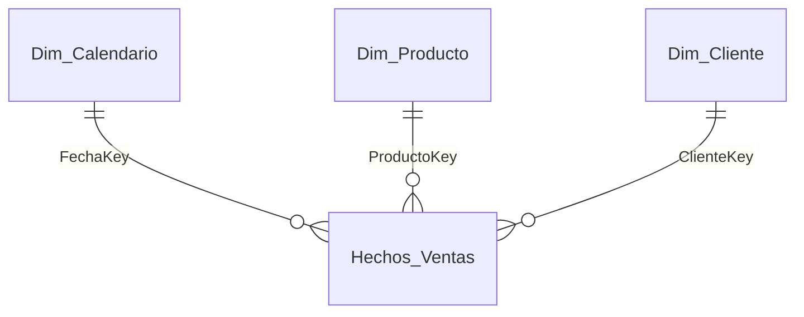

# Prompt 02 · MODELAR — diseño del modelo estrella

> Fase 2. Corré esto después de aprobar la Fase 1.

---

```
FASE 2 — MODELAR.

Con las preguntas y KPIs que definimos, diseñá el modelo de datos en esquema
estrella. Devolveme:

1. TABLAS: para cada una indicá si es HECHO o DIMENSIÓN y su grano
   (qué representa una fila).

2. COLUMNAS por tabla: nombre, tipo de dato, y si es clave / oculta.

3. RELACIONES (tabla): Desde (dim.clave) → Hacia (hecho.clave) |
   Cardinalidad (1:*) | Dirección del filtro.

4. TABLA CALENDARIO: proponé su definición (rango de fechas y columnas
   Año/Mes/Trimestre/etc.).

5. DIAGRAMA en Mermaid (erDiagram) para verlo.

6. ADVERTENCIAS de modelado: tablas sueltas, relaciones ambiguas, copo de
   nieve a evitar.

Regla: una sola tabla de hechos por grano. Ocultá las claves. Marcá supuestos.
Al terminar, preguntame si avanzamos a la Fase 3 (MEDIR).
```

---

💡 El diagrama Mermaid que devuelva lo podés pegar en un `.md` de GitHub y se dibuja solo. Ejemplo del formato esperado:


