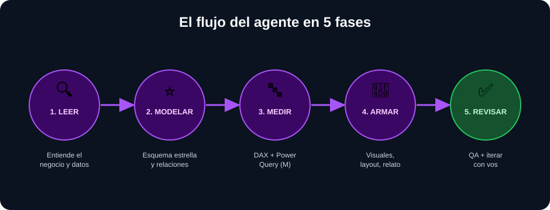

# 03 · El flujo con IA (visión general)

[⬅️ Anterior](02-instalar-power-bi.md) · [Índice](../README.md) · [Siguiente: Preparar datos ➡️](04-preparar-datos.md)

---

El agente no reemplaza a Power BI: **prepara todo el material** para que vos solo armes. Se apoya en 5 fases, cada una con su prompt en [`agente-ia/prompts/`](../agente-ia/prompts/).

## 1. 🔍 LEER — entender el negocio
Le das al agente contexto: un [brief de la empresa](../agente-ia/plantillas/brief-empresa.md), una muestra de datos, o la lista de tablas de una base. El agente devuelve:
- Las **preguntas de negocio** que el informe debe responder.
- Los **KPIs** candidatos.
- La **audiencia** (gerencia, operaciones, cliente).

➡️ Prompt: [`01-lectura-proyecto.md`](../agente-ia/prompts/01-lectura-proyecto.md)

## 2. ⭐ MODELAR — diseñar el esquema
El agente propone el **modelo estrella**: cuál es la tabla de hechos, qué dimensiones hay, qué claves las unen. Entrega un diagrama y las relaciones.

➡️ Prompt: [`02-diseno-modelo.md`](../agente-ia/prompts/02-diseno-modelo.md) · Teoría: [doc 05](05-modelo-estrella.md)

## 3. 🔤 MEDIR — DAX + Power Query
Con el modelo definido, el agente escribe:
- El **Power Query (M)** para limpiar/transformar cada tabla.
- Las **medidas DAX** (totales, % variación, YTD, ranking…).

➡️ Prompt: [`03-generar-dax.md`](../agente-ia/prompts/03-generar-dax.md) · Teoría: [doc 04](04-preparar-datos.md) y [doc 06](06-medidas-dax.md)

## 4. 📐 ARMAR — layout e informe
El agente te da un **plano del informe**: qué visual usar para cada pregunta, dónde ubicarlo, qué filtros poner, y un **texto narrativo** que explica los resultados.

➡️ Prompt: [`04-armar-informe.md`](../agente-ia/prompts/04-armar-informe.md) · Teoría: [doc 07](07-visuales-y-diseno.md)

## 5. ✅ REVISAR — QA e iteración
El agente revisa: ¿los totales cierran?, ¿hay medidas sin usar?, ¿faltan filtros de seguridad?, ¿los nombres son claros? Iterás hasta que quede.

➡️ Prompt: [`05-revision-qa.md`](../agente-ia/prompts/05-revision-qa.md)

## Regla de oro
> **Nunca pegues una medida DAX sin entender qué hace.** El agente acelera, pero vos sos quien firma el informe. Cada prompt te pide que la IA **explique** lo que genera.

---

[⬅️ Anterior](02-instalar-power-bi.md) · [Índice](../README.md) · [Siguiente: Preparar datos ➡️](04-preparar-datos.md)
