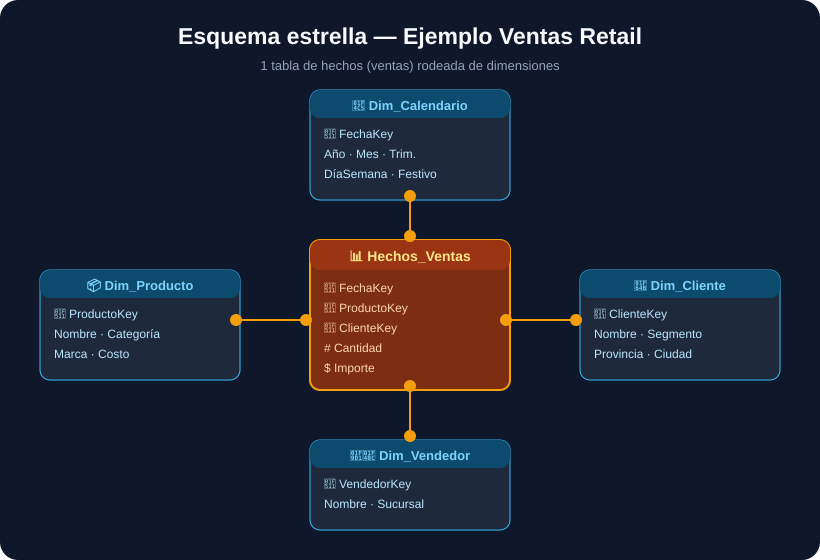

# 05 · El modelo estrella (y PBIP / TMDL)

[⬅️ Anterior](04-preparar-datos.md) · [Índice](../README.md) · [Siguiente: Medidas DAX ➡️](06-medidas-dax.md)

---

<p align="center"></p>

## Hechos vs. dimensiones

- **Tabla de hechos** → los **eventos que medís** (una venta, un movimiento, un registro de avance). Tiene **números** (importe, cantidad) y **claves** hacia las dimensiones. Es larga y angosta (muchas filas, pocas columnas).
- **Tabla de dimensión** → el **contexto** (quién, qué, cuándo, dónde). Producto, Cliente, Calendario, Vendedor. Es corta y ancha.

La forma resultante —una tabla de hechos en el centro rodeada de dimensiones— se llama **esquema estrella**. Es el que Power BI maneja **más rápido y más claro**. Evitá el "copo de nieve" (dimensiones colgando de otras dimensiones) salvo que haga falta.

## Crear relaciones
En la vista **🔗 Modelo**, arrastrá la clave de la dimensión (`ProductoKey` en `Dim_Producto`) sobre la misma clave en la tabla de hechos. Power BI crea una relación **1 a muchos** (la dimensión es el "1"). Verificá:
- **Dirección del filtro:** normalmente **única** (de la dimensión hacia los hechos).
- **Cardinalidad:** 1:* (uno a muchos).
- Que **no queden tablas sueltas** sin relacionar.

## Buenas prácticas de modelo
- Una **sola tabla de hechos por grano** (no mezcles ventas con presupuesto en la misma tabla; relacionalas por dimensiones compartidas).
- **Ocultá** las columnas de clave (`...Key`) para que nadie las arrastre por error.
- Poné las **medidas** en la tabla de hechos (o en una tabla vacía "_Medidas").
- Nombres consistentes: `Dim_` para dimensiones, `Hechos_` para hechos.

## PBIP / TMDL — versionar en Git
El formato moderno **Power BI Project (.pbip)** guarda el informe como **carpeta de archivos de texto**:

```
MiInforme.pbip
MiInforme.SemanticModel/
  └── definition/
        ├── tables/Hechos_Ventas.tmdl
        ├── tables/Dim_Producto.tmdl
        └── relationships.tmdl
MiInforme.Report/
  └── report.json
```

Ventajas:
- **Diffs legibles** en Git (ves qué medida cambió).
- Un **agente de IA puede generar el `.tmdl`** directamente.
- Trabajo en equipo sin pisarse.

### Ejemplo de una tabla en TMDL
```tmdl
table Hechos_Ventas
    column Importe
        dataType: decimal
        summarizeBy: sum
        sourceColumn: Importe

    column FechaKey
        dataType: dateTime
        isHidden: true

    measure 'Ventas totales' = SUM(Hechos_Ventas[Importe])
        formatString: "\$#,0"
```

Para activarlo: **Archivo → Opciones → Características de vista previa → Power BI Project (.pbip)** y guardá con **Archivo → Guardar como → .pbip**.

---

[⬅️ Anterior](04-preparar-datos.md) · [Índice](../README.md) · [Siguiente: Medidas DAX ➡️](06-medidas-dax.md)
